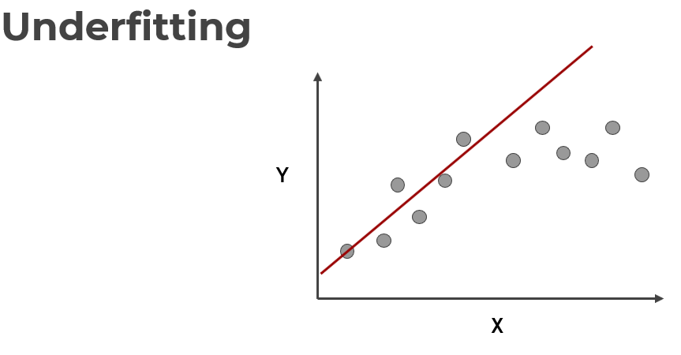

# Python for Data Science and Machine Learning

Bootcamp for python data science and machine learning

www.kaggle.com
- Data Science site w/ data sets and competitions

## NumPy

1. Linear Algebra library for python
    - Very important b/c almost all libraris in the PyData ecosystem rely on NumPy
1. Incredibly fast
    - Bindings to C libraries

## Pandas

Python's version of Excel or R dataframes

1. Open source library built on top of NumPy
1. Allows for fast analysis and data cleaning and preparation
1. Excels in performance and productivity
1. Built-in visualization features
1. Work w/ data from a wide variety of sources

### DataFrame

1. A collection of series that share an index
1. We'll be using 'axis=1' or 'axis=0' a lot
    - Datafram is built on top of pandas
    - Dataframe.shape is a tuple
    - (5, 4): 5 refers to rows, 4 to columns (thus 0, 1)

## Seaborn

[Documentation](http://seaborn.pydata.org/)

# Machine Learning

## Supervised Learning

1. Supervised learning algorithms are trained using **labeled** examples such as input where desired output is known
    - It's already classified and will then get future data
    - Spam vs Legitimate email
    - Positive vs Negative movie review
1. Network receives a set of inputs along w/ corresponding correct outputs
    - Algorithm learns by comparing it's actual output w/ correct outputs to find errors
    - Then it modifies the model

**The above image contains an issue**

- Is it fair to use or single split of the data to evalutate our model's performance?
    - Considering we can change the model parameters again and again

1. To fix this issue, data is often split into 3 sets
    - Training Data: Used to train parameters
    - Validation Data: Used to determine what model hyperparameters to adjust
    - Test Data: Used to get some final performance metric
1. After we see results on the **final test set** we don't go back and adjust any model parameters
    - The final measure is what is labeled as the true performance of the model
1. In this course, we will simplify our data by using a simple **train/test split**
    - We will simply train and then evaluate on a test set
    - You can later go back and adjust parameters

## Overfitting and Underfitting

- Overfitting
    - The model fits too much to the noise from the data
    - Often results in **low error on training sets, but high error on test/validation sets**

- Underfitting
    - Model does not capture the underlying trend of the data and does not fit the data well enough
- Low variance, but high bias
- Underfitting is often a result of an excessively simple model

## Evaluating Performance: Classification

1. Accuracy
    - Number of correct predictions made by the model divided by the total number of predictions
1. Recall
    - Ability of a model to find all relevant cases w/i a dataset
    - Number of true positives divided by number of true positive plus number of false negatives
1. Precision
    - Ability of a classification model to identify only the relevant data points
    - Number of true positives divided by number of true positives plus number of false positives
1. F1-Score
    - In cases where we want to find an optimal blend of precision and recall, we can combine the two using the F1 score
    - The harmonic mean of precision and recall
    
    - Use harmonic mean instead of simple average
        - Punishes extreme values
    - Classifier w/ precision of 1 and recall 0
        - Simple average = 0.5
        - F1 score = 0

- In any classification task, your model can achieve two results
    - Correct prediction
    - Incorrect prediction
- Incorrect vs correct expands to situations where you have multiple classes
- Often you have a trade-off b/t Recall and Precisions

### Confusion Matrix

All correctly classified vs incorrectly classified images

All fundamentally ways of comparing predicted values vs true values

## Evaluating Performance: Regression

1. Regression is when a model attempts to predict continuous values
    - Unlike categorical values (classification)
1. Accuracy and recall aren't usefull for regression problems
    - Attempting to predict the price of a house given its features is a **regression task**
    - Attempting to predict the country a house is in given its features is a **classification task**
1. Most common evaluation metrics for regression
    - Mean Absolute Error
    - Mean Squared Error
    - Root Mean Square Error

### Mean Absolute Error (MAE)

- Won't punish Large Errors
    - We want our =error metrics to account for these!

### Mean Squared Error (MSE)

- Mean of the squared errors
- Larger erros are noted more than MAE, so this is more popular

### Root Mean Square Error (RSME)

- Root of the mean of the squared errors
- Most popular

- Most common question: 'Is this value of RMSE good?'
    - Context matters
    - RMSE of $10 for a house is good, but for a candy bar, terrible
- Compare error metric to average value of the label in data set
- Domain knowledge is also important

## Unsupervised Learning

When we don't have historical labels

Evaluation is much harder and more nuanced

1. Clustering
    - Grouping together **unlabeled** data points into categorical/clusters
    - Data points are assigned to a cluster based on similarity
1. Anomaly Detection
    - Attempts to detect outliers in a dataset
    - Fradulent transactions on a credit card
1. Dimensionality Reduction
    - Data processing techniques that reduce the number of features in a data set
        - Compression or to better understand underlying trends